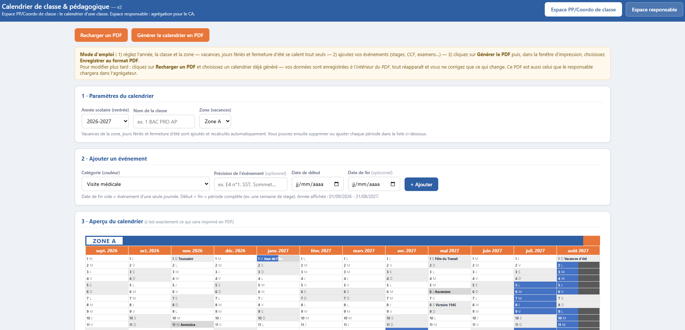
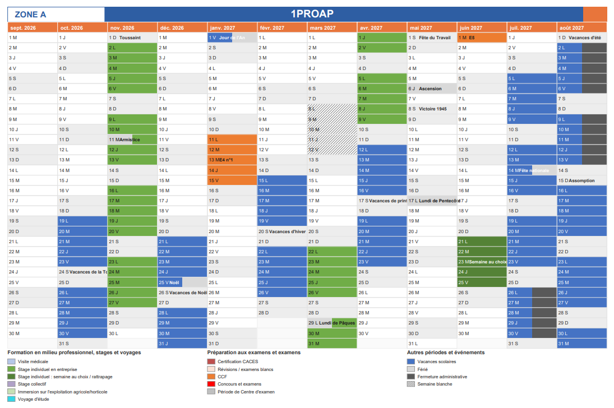
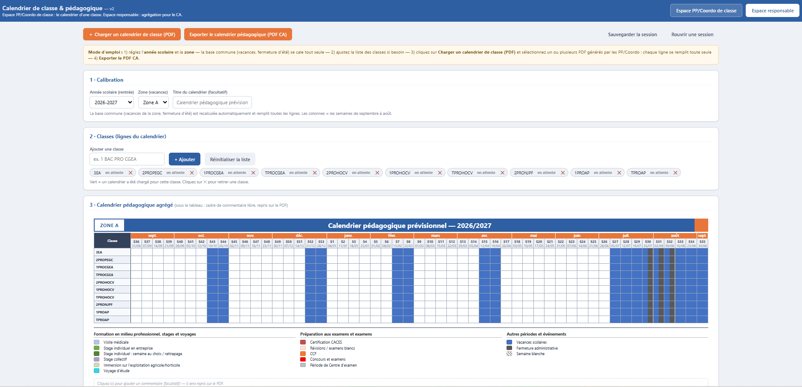
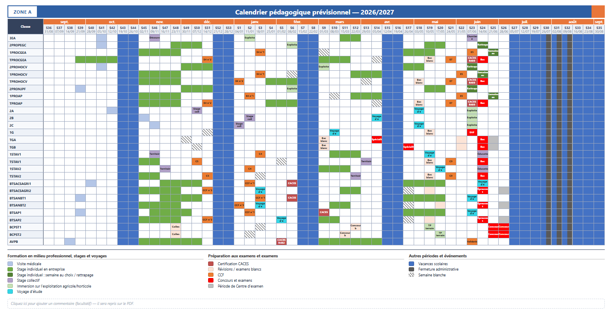

## Le point de départ

La première version de l'outil permettait aux professeurs principaux et aux coordonnateurs de construire le calendrier prévisionnel de leur classe en quelques minutes. Elle a été utilisée à la rentrée et a suscité de l'intérêt au-delà du campus, chez des cadres d'établissements d'enseignement et de formation.

Restait la moitié la plus ingrate du processus : la consolidation. Une trentaine de calendriers de classe à reprendre un par un pour établir le calendrier pédagogique présenté et voté en instance. Un travail de report, long et exposé aux erreurs de recopie.

Cette version ajoute donc un second espace, dédié au responsable chargé de cette agrégation. Le principe de l'outil ne change pas : **un fichier HTML unique, qui s'ouvre dans un navigateur, sans installation, sans compte et sans aucune donnée personnelle collectée ni transmise.**

## Deux espaces dans un même fichier

Les données présentées dans les captures ci-dessous sont fictives.

### 1 · L'espace PP / Coordo de classe

Le calendrier d'une classe, en vue à la journée, comme dans la première version. Quelques ajustements mineurs fluidifient la saisie, et une catégorie a été ajoutée après les premiers tests de l'équipe : la semaine blanche. On conserve la possibilité de recharger un calendrier déjà généré pour le corriger au fil de l'année, sans tout reprendre.

*Paramètres, saisie des événements et aperçu sur un même écran.*

### 2 · Le calendrier de classe en PDF

L'export d'une classe : l'année scolaire complète sur une page, prête à imprimer ou à diffuser.

*Le calendrier d'une classe, de septembre à août, en vue à la journée.*

### 3 · L'espace responsable

Vous avez conservé les PDF transmis par les enseignants ? Chargez-les tous d'un coup : chaque ligne de classe se remplit automatiquement. Aucune ressaisie, aucun copier-coller.

L'accès est protégé par un mot de passe, `responsable`, modifiable directement dans le code du fichier HTML avec un éditeur de texte. Il ne s'agit pas d'une sécurité au sens strict : il sert seulement à éviter que les collègues les moins à l'aise avec le numérique n'ouvrent par erreur un espace qui ne les concerne pas.

*Les classes chargées passent au vert ; le tableau de synthèse se construit au fur et à mesure.*

### 4 · Le document de synthèse

Le résultat : toutes les classes, semaine par semaine, de septembre à août, sur une seule page, avec un cadre de commentaire libre repris sur le PDF. Malgré des lignes volontairement chargées pour la démonstration, l'ensemble reste lisible au regard de la quantité d'informations restituées.

*Le document de synthèse, en vue à la semaine, tel qu'il est présenté en instance.*

## Le PDF comme format d'échange

Les flux entre l'équipe et le responsable passent uniquement par des PDF, pour trois raisons :

- tout le monde sait l'ouvrir et l'imprimer, sans logiciel particulier ;
- il est difficilement modifiable, ce qui fiabilise ce qui est transmis ;
- chacun travaille sur son propre fichier, jamais sur celui du voisin, et on le retrouve facilement dans une boîte mail.

Les données de saisie sont enregistrées **à l'intérieur du PDF lui-même**. Le même fichier sert donc à la fois de document à diffuser, de sauvegarde rechargeable par l'enseignant, et de source pour l'agrégation par le responsable.

## Quelques principes de conception

**L'IA n'entre jamais en contact avec les données.** La question de la confidentialité est contournée en demandant à l'IA de produire l'outil, et non de traiter les données : c'est l'outil HTML qui les manipule, sur le poste de l'utilisateur. Le développement se fait entièrement avec des données fictives.

**La chaîne d'accès doit être la plus courte possible.** Le fichier est hébergé sur un espace de partage — GitHub ici — et mis à disposition par un lien sur un mur numérique — Digipad ici. Pas de compte à créer, pas d'identification. De l'accès à l'usage jusqu'à la réception de l'export, on vise une expérience assez simple pour embarquer toute l'équipe.

**L'uniformité de la légende conditionne la lisibilité de la synthèse.** Les catégories sont figées dans l'outil et identiques pour toutes les classes : c'est ce qui permet à l'agrégation d'être immédiatement lisible.

## Réalisation

Outil développé avec l'IA Claude, en vibe coding.

## État d'avancement

La version 1 reste en ligne le temps de la transition. Les retours sur cette version 2 sont bienvenus.
