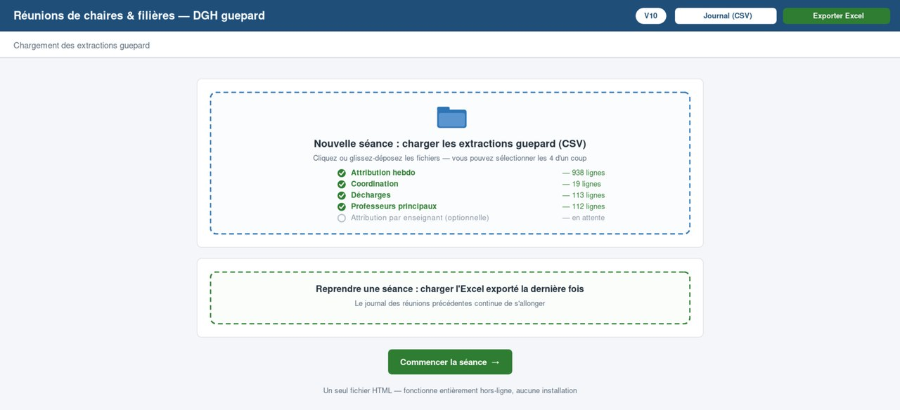
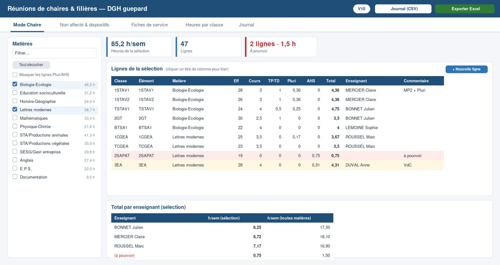
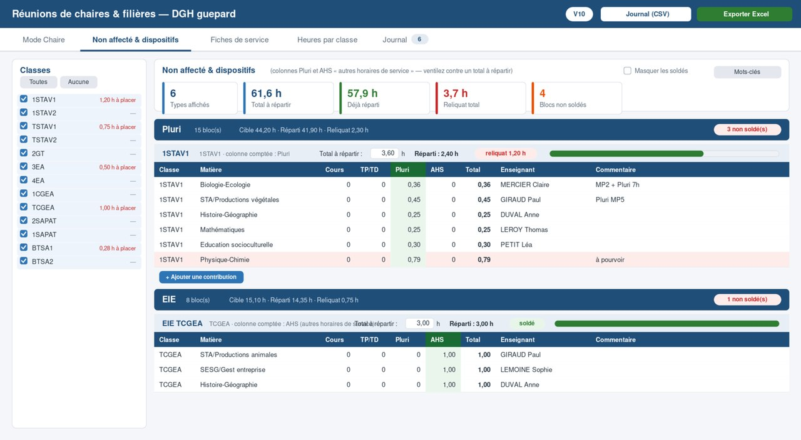
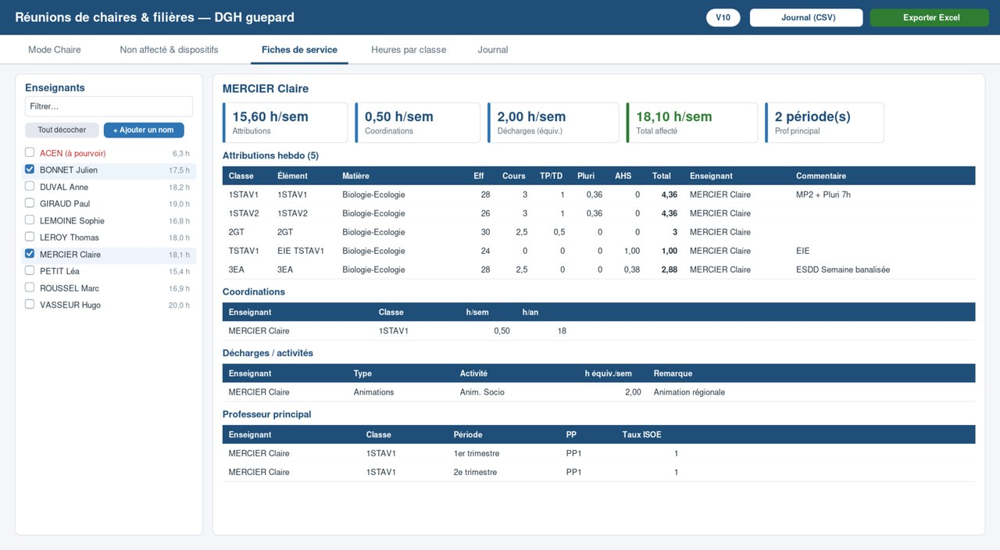
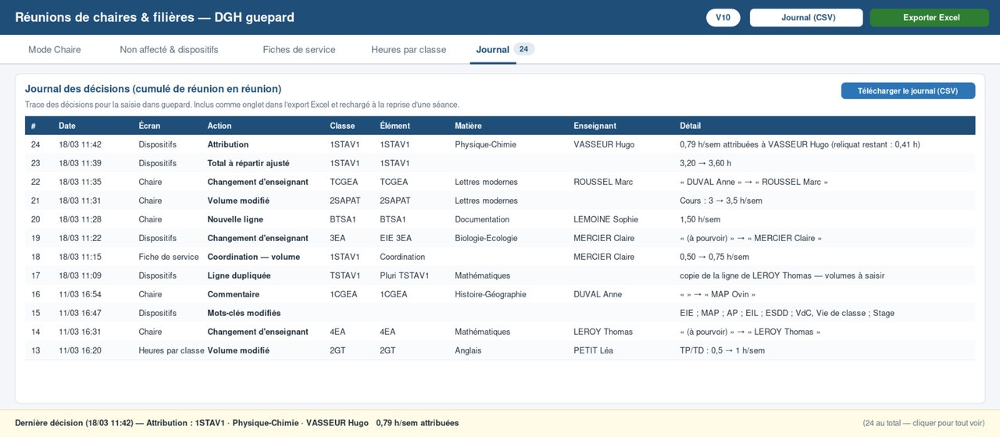

## Conduire les réunions de chaire et de filière et préparer le scénario Guepard, en un seul outil

Chaque printemps, des réunions sont organisées pour préparer la rentrée suivante : répartir la dotation globale horaire, matière par matière, filière par filière. Un moment décisif, très attendu des enseignants. Selon la taille de l'établissement, un volume conséquent de données doit être manipulé et reporté, et l'erreur dans les attributions n'est pas permise.

La difficulté de l'exercice tient à ce qu'il faut faire dialoguer le point de vue de l'enseignant, centré sur sa fiche de service, et la vision globale de la direction, qui intègre d'autres enjeux.

D'où ce projet : faire de l'extraction Guepard un véritable support d'animation de réunion, et un carnet de bord qui mémorise l'historique des décisions prises en séance.

## Trois principes de conception

- **Le format HTML**, plus ergonomique pour l'animateur et plus visuel pour les participants. L'historique se conserve en exportant un fichier Excel, que l'on recharge d'une réunion à l'autre.
- **Les données sensibles ne sont jamais transmises à l'IA.** Il s'agit ici de services individuels d'agents : je ne demande pas à l'IA de traiter les fichiers, mais de produire l'outil qui, lui, les traite localement, sur le poste. Le développement se fait sur une copie avec des données fictives, compatible RGPD.
- **Tracer la décision, pas seulement le résultat.** Ce qui se dit en réunion doit pouvoir se ressaisir fidèlement dans Guepard, plusieurs jours plus tard.

## Les écrans de l'outil

### 1 · Le chargement

*On dépose les extractions Guepard — attribution hebdomadaire, coordination, décharges, professeurs principaux. L'outil les reconnaît au nom de leurs colonnes, quel que soit l'ordre. On obtient la ventilation Guepard actuelle, à mettre à jour de réunion en réunion pour préparer la rentrée.*

### 2 · Le mode chaire

*On coche une ou plusieurs matières : toutes les lignes s'affichent avec leurs classes, leurs volumes et leurs enseignants. Changer un enseignant, ajuster un volume, créer une ligne, marquer « à pourvoir » — chaque geste met les compteurs à jour, dont le total par enseignant. De quoi animer les réunions de chaire et valider la répartition.*

### 3 · Le non affecté et les dispositifs

*Les heures de pluridisciplinarité et les autres horaires de service (AHS) sont regroupées par type — Pluri, EIE, MAP, ESDD… — puis par classe. Chaque bloc affiche sa cible, son réparti et son reliquat, et ne compte que la colonne concernée. Utile en réunion de chaire comme de filière.*

### 4 · Les fiches de service

*Vue par enseignant de tout ce qui lui est affecté : attributions, coordinations, décharges, professeur principal, avec les totaux. L'outil présente les heures ; la direction, qui connaît ses agents, apprécie elle-même la complétude du service.*

### 5 · Le journal des décisions

*L'historique de toutes les décisions s'inscrit ici : chaque modification est enregistrée et horodatée, avec son avant/après. Visible en permanence pendant la séance, il se cumule d'une réunion à l'autre grâce au téléchargement et au rechargement du fichier Excel. Une fois les réunions conduites, ce carnet de bord guide la saisie du nouveau scénario Guepard.*

---

Les captures présentent des données fictives ; les fichiers réels sont traités localement et ne quittent jamais le poste.
