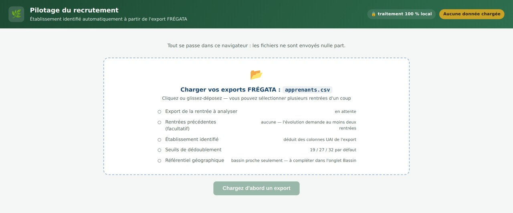
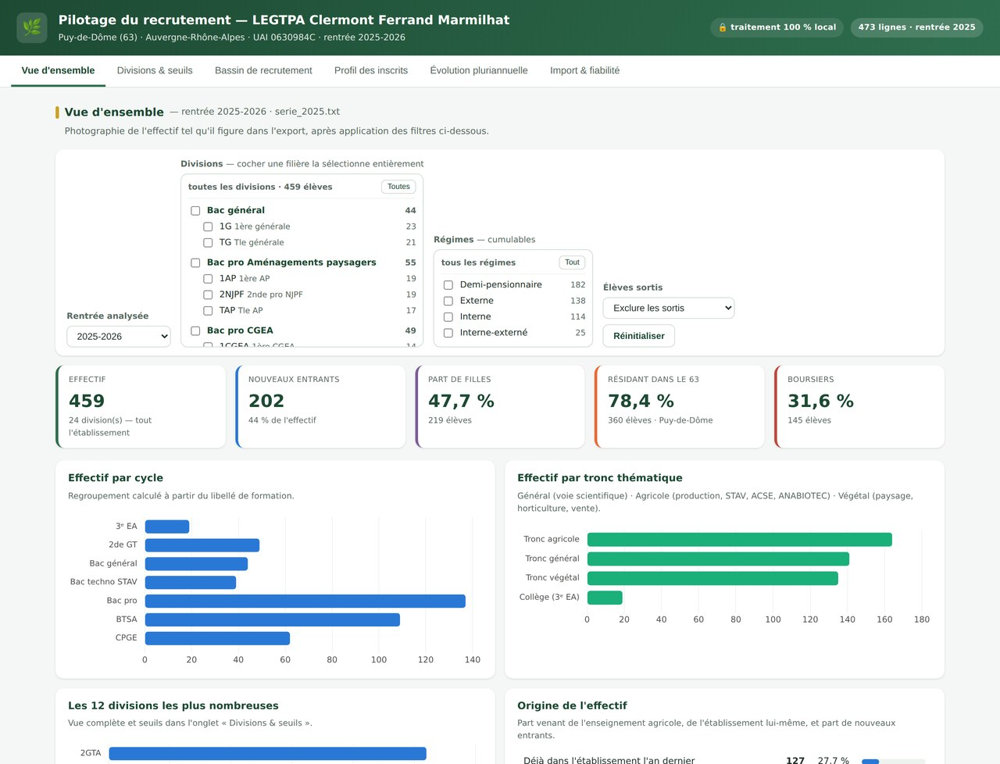
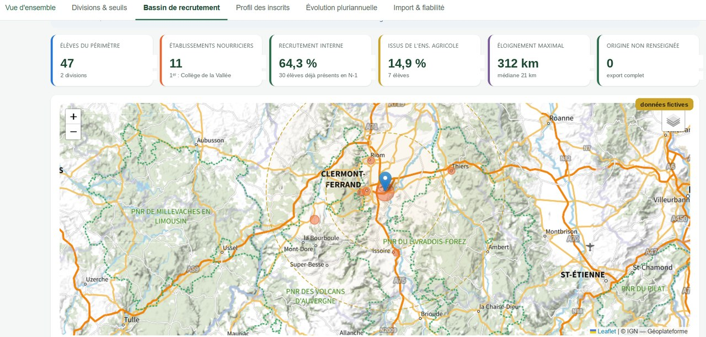
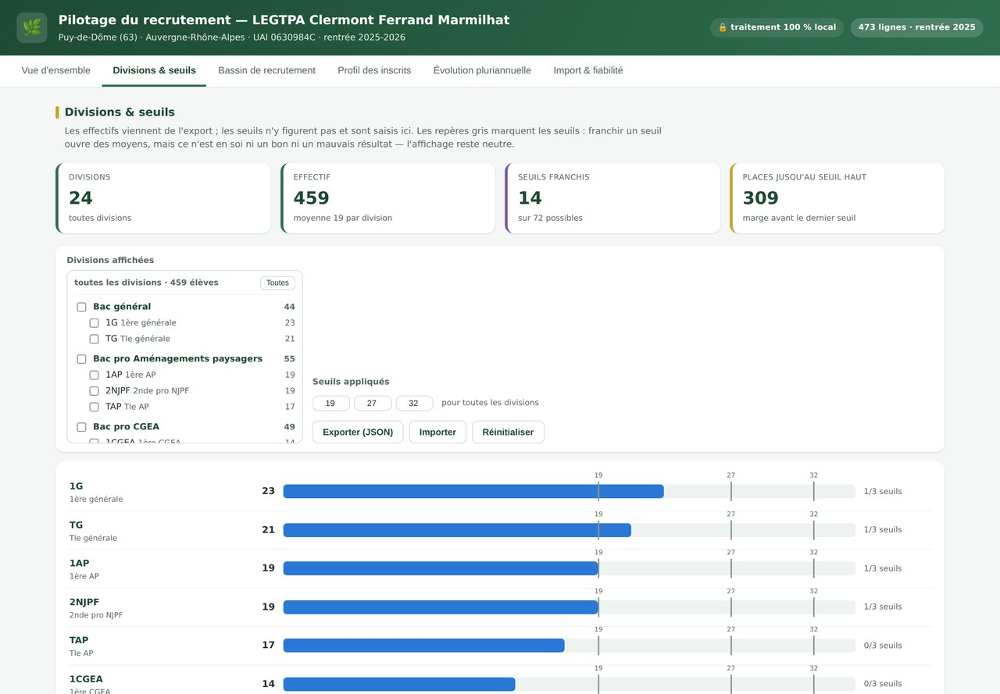
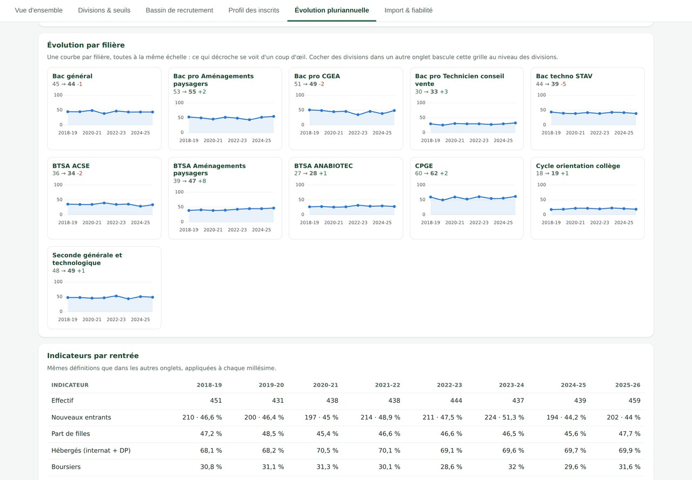

## Et si nos bases de données devenaient un véritable outil de pilotage du recrutement ?

Dans le cadre du lancement du Programme national d'orientation et de découverte des métiers du vivant (PNOD), annoncé le 8 septembre par la ministre de l'Agriculture et de la Souveraineté alimentaire, l'enseignement agricole se mobilise pour renforcer l'attractivité de ses formations.

À l'échelle d'un établissement, cet objectif appelle une stratégie de recrutement qui doit s'appuyer sur des données concrètes. La base de données FRÉGATA en est la source idéale, qui reste trop souvent sous-exploitée. D'où ce projet : mieux exploiter nos bases pour renforcer notre stratégie de recrutement, en cohérence avec les axes du PNOD.

## Trois principes de conception

- **Une approche par la datavisualisation.** Chaque écran répond à une question de pilotage d'un coup d'œil, plutôt que d'afficher un tableau de plus.
- **Le format HTML plutôt qu'un notebook Python.** Le même outil aurait pu être développé en Python, mais il n'aurait pas pu être pris en main par des pairs sans compétences en développement. Un fichier qui s'ouvre dans un navigateur se partage sans prérequis ni installation.
- **Les données sensibles ne sont jamais transmises à l'IA.** Je ne lui demande pas de traiter les fichiers, mais de produire l'outil qui, lui, les traite localement dans le navigateur. Le développement se fait sur une copie de la base avec des données fictives, compatible RGPD.

## Les écrans de l'outil

### 1 · L'import et la fiabilité

*On dépose les exports FRÉGATA : l'outil exploite les données à partir du nom des colonnes. On peut charger la base de l'année en cours et celles des années précédentes pour enrichir l'analyse. Le même écran contrôle la qualité de l'export avant analyse — lignes ignorées, colonnes manquantes, valeurs non reconnues — pour savoir sur quoi reposent les chiffres affichés.*

### 2 · La vue d'ensemble

*Effectifs, nouveaux entrants, répartition par filière, origine géographique. Le périmètre se coche — une filière, une classe, un régime — et toutes les vues se mettent à jour.*

### 3 · Le bassin de recrutement

*Chaque point — commune de résidence ou établissement d'origine — indique les divisions d'accueil : de quoi valoriser les partenariats avec les établissements voisins et cibler la communication.*

### 4 · Les effectifs et les seuils

*Chaque division face aux seuils de dédoublement, à l'échelle de la commune, pour évaluer d'un coup d'œil la capacité d'accueil.*

### 5 · L'évolution pluriannuelle

*Une courbe par filière, toutes à la même échelle : un état de référence pour apprécier les effets des actions d'orientation.*

---

Outil en version 1. Les captures présentent des données fictives ; les fichiers réels ne quittent jamais le navigateur.
